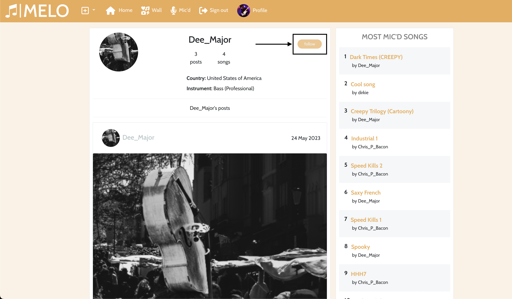

# Melo

## Portfolio Project 5: Advanced Front End Development

This project is built as part of the Code Institute Full Stack Software Development course. For this course, Dirk Ornee had to built a fifth Portfolio Project. The focus with this project lies on having a good interactive front-end built in React and a backend built with Django REST that functions as a API to the frontend. This repo contains the front end part of the project. Since Dirk Ornee is himself a musician, it seemed a good idea to built a social media platform for musicians, where users can find a connect with other musicians and discover and promote new music.

## Live Site

[Melo](https://melo.herokuapp.com/)

## Github Repository

[PortfolioProjectFive](https://github.com/DOdrums/PortfolioProjectFive)

<!-- TOC -->

- [Smart House Inventory](#smart-house-inventory)
  - [Portfolio Project 4: Full Stack Toolkit](#portfolio-project-4-full-stack-toolkit)
  - [Live Site](#live-site)
  - [Github Repository](#github-repository)
  - [UX](#ux)
    - [Business Goals](#business-goals)
    - [Target Audience](#target-audience)
    - [User Stories](#user-stories)
    - [Structure of the app](#structure-of-the-app)
    - [Logic/Database Diagram](#logicdatabase-diagram)
    - [Color Scheme](#color-scheme)
    - [Features](#features)
      - [Book page](#book-page)
      - [User dashboard](#user-dashboard)
      - [Home](#home)
      - [Nav bar](#nav-bar)
      - [Hero Image](#hero-image)
      - [Treatments](#treatments)
      - [About](#about)
      - [Footer](#footer)
      - [About](#about)
      - [Treatments](#treatments)
      - [Gallery](#gallery)
      - [Contact](#contact)
      - [Login/Logout](#loginlogout)
      - [Admin](#admin)
    - [Future Features](#future-features)
      - [Notifications](#notifications)
  - [Credits](#credits)
    - [Code](#code)
    - [Images](#images)
    - [Technologies used](#technologies-used)
  - [Testing](#testing)
  - [Security Features and Defensive Design](#security-features-and-defensive-design)
    - [User authentication](#user-authentication)
    - [Form Validation](#form-validation)
    - [Database Security](#database-security)
  - [Deployment](#deployment)
    - [Local Deployment](#local-deployment)
    - [Production Deployment Initial](#production-deployment-initial)
      - [Create Heroku app:](#create-heroku-app)
      - [Connect Postgres Database:](#connect-postgres-database)
      - [Deploy App on Heroku:](#deploy-app-on-heroku)
    - [Production Deployment Update](#production-deployment-update)
      - [PostgreSQL database:](#postgresql-database)
  - [Acknowledgements](#acknowledgements)

<!-- /TOC -->

## UX

### Business Goals

The main goal of this project is to give a user the ability to interact with other musicians and share their own contanct in a social media platform called Melo. By creating a profile in Melo, the user should also be able to share with the network information such as country of residence, instrument of choice and level, and whether they are looking for a bandmember or a band to play in.

### Target Audience

It might be obvious, but the target audience of this social media platform is musicians. Melo is the platform where musicians from all level and genre get to together and share their love for music. It is made for beginners to get inspired and follow their role models, but also for professional to share their lastest proects and tunes.

### User Stories

The user stories have the following criteria:

- title
- clear description
- acceptance criteria
- tasks, when acceptance criteria alone weren't clear enough
- story points
- epic
- priority (must have, should have, could have)

In the picture below you can see an example of the user stories before work on the project was started:

And the user stories board after finishing the project:

As you can see, five user stories was left, which didn't fit in the scope of the project in the end. Since they were a 'could have' or 'should have' the decision to leave it out was easily made. To view all the user stories in detail, visit the project page: [user stories board](https://github.com/users/DOdrums/projects/3/views/1)**{<-- link needs to change}**

### Structure of the app

The app is designed to have a natural flow, with a strong focus on the booking functionality. Most pages include booking buttons or calls to book an appointment. The home page specifically features a booking button right on top, so a user doesn't have to scroll at all to make an appointment. This is especially handy and necessary for recurring customers, who will be the gross of the clientele.

### Logic/Database Diagram

The logic of the app was thought out by making a database diagram, to visualize which objects will need to be created for this app to be functional and how they will be connected to each other. Notably, the initial database diagram was incomplete, which was discovered during production of the app. See the images below:

Initial database diagram:

Updated database diagram:

Django's Class-Based Generic Views were used, to build the models in an Object Oriented way. For the User model specifically, the Django package 'AllAuth' was used. This does a lot of the work for you, like creating unstyled login, sign-up and forgot password pages and functionality and creating the User model and User Manager model. For the purposes of this project, these two models had to be overridden, since a email address is used for authentication, instead of a username. Furthermore, phone number was added to the user model.

Let's quickly go through the other models:

The Treatment model:

- used to make a treatment object (the different kind of available treatments at the salon).
- has a 'display' parameter, meaning: to be displayed on the homepage and treatments page or not.
- has an 'active' parameter, meaning: to be displayed in the booking tool or not.
- images are stored in Cloudinary via a CloudinaryField.

The User model:

- built with Django AllAuth.
- added phone_number, first_name and last_name.

The Appointment model:

- has foreign key relationships with the user model and treatment model.
- any appointment will always have a treatment object selected as a foreign key.
- any appointment can have a user selected as foreign key.

The Planning model:

- is used to configure available/bookable times in the datepicker
- allow_times takes a comma separated list of time values, for example: 10:00, 10:15, 10:30 etc. This indicates which times on any given day are bookable.
- disabled_days takes a comma separated list of dates, for example: 10.10.2022, 10.11.2022, 10.12.2022, etc. This indicates days that are off, like holidays.
- disabled_weekdays takes a comma separated list of numbers, for example: 0, 3, 6. This indicates, with sunday starting at value '0', the days in any given week that are off. So, in the example given, sunday, wednesday and saturday are off days. This will repeat every week.
- in the datepicker itself, all available times are calculated by using the values available in the active Planning Object and by removing any times from the datepicker where appointments already exist.

The Gallery model:

- used to upload images to Cloudinary, for use on the gallery page.
- can be added, removed and set to active from the admin panel.

### Color Scheme

The color scheme of the salon itself was used, see the image below. It creates a very feminine and calm look, which perfectly fits the nail polish theme.

### Features

The app is divided in multiple features that create a full and complete product. Since this is a social media platform, there is a small but significant different for users that sign in in their account or not. Let's start from this distincion:

#### Welcome to Melo

When a user first go to https://melo.herokuapp.com/, the view will be as showed below:

In this page is all users will be able to see post from other users and most mic'd songs (will be described later), even if they haven't signed up in the platform. For this reason, in this page, they will have the chance to perform two main actions: sing in and sign up.

With the sign up bottom, they will be rerouted to a sign up form which asks for basic information manemy the Username, new password, and confirmation of the password. By clicking on the 'sing up' bottom, they will create a account. However, if they already have a profile, they will be able to log in following the "Already have an account? Sing in" bottom below the form, or the 'Sing in' bottom in the top bar.

When the user has already a profile, they can click on the 'Sign in' bottom with will take them to the sing in page. This page asks only for the Username and password and gives the chance to create a new account with the 'Don't have an account yet? Sign up.' bottom.

Once the user is signed in with their (new) account, they will have more options in the top bar, as it shown in the picture below. 

Let's talk about each of these feautes one by one starting with the Home page.

#### Home page

As discussed earlier, the home page is visible for both users that don't have an account yet, and for those who do. This section is divided into two main features, the posts and song sections, and the 'Most mic'd songs' section.

1. The post and song section displayes all posts and song uploaded by any user in chronological other, from newest to oldest. 

In this page, users are able to:
- like a posts by clicking on the heart icon below the picture. The heart will turn red to confirm the like
- like a song by clicking on the microphone (mic) incon below the song. The mic will turn red to confirm the like (as shown in picture above)
- comment on posts and songs by clicking on the speach bubbles icon below the posts and songs. This will take the user to anothe page where they can add their comment and view other comments, as shown in the picture below.

It is important to keep in mind that only users who are singed in in their account will be able to like and comment on posts and songs.

2. The other section in the Home page is the 'Most mic'd songs'. This is the top 10 list of the most mic'd (like by clicking on the mic icon) songs of all time. It is created by calculating the amount of mics songs posted in the home page have. The song with the most mics, becames number one in the list. Users can always click on any of the songs in the list to have a listen and view the comments left for that song.

Fun fact about the "Most micd songs" feauture is that it doesn't only appear in the home page, but also in all the other pages (wall. mic'd and profile) so users can always related to this list.

### Wall page

Users can go to their wall by clicking on the icon on the top bar. As one might noticed, it looks very similar to the Home page. The difference between the Home page and the wall is that while in the Home page the user views posts and songs from all the accounts in Melo, in their wall they view posts and songs _only_ from accounts they follow.

A user can follow and unfollow an account by clicking on the username on top of the post or song. This will bring them to the account's profile and on the top right corner of the profile, the user can click on the bottom to follow or unfollow the account.

More details about the profile page will be describe later in this feature list.

#### Mic'd page

In the Mic'd page, the user is able to view all the song they mic'd (liked by clicking on the mic icon) from all accounts, even if they don't follow them. 

The user can of course decide to un-mic'd songs at any point by clicking on the red mic under the song. The mic will turn grey and the song will be removed from the Mic'd page. 

#### Profile page

By clicking on the 'profile button', the user will view their own profile. This includes the main information they decide to share with the network, icluding:
- name
- profile picture
- whether or not they are looking for a bandmate or a band to play in
- country of residence
- alias
- bio
- contact info.

Below the personal information, the user can also view their own posts and songs.

If the user wants to make any changes to their personal information, they will be able to do so by clicking on the thee dots on the right top corner.
With this list, the user can also opt to add ot edit their instrument of choice, change their username and password.

#### Treatments

The treatments page features the main treatments with explanations of what they are. There is also a book button for the user to immediately book an appointment.

#### Gallery

The gallery page displays a little gallery with some images of recent work done by Nailsbyfaar. On the bottom of the page, the user is encouraged to visit her instagram.

#### Contact

The contact page displays a simple form for the user to fill out in order to send a message to the owner.

#### Login/Logout

If a user doesn't have an account yet, they can sign up, by filling in the form.

Once a user has an account, they can login.

If the user wants to logout via the navbar, they'll have to confirm this decision.

#### Admin

Site owner has a lot of control over the website and database entries via the admin panel. If they login as a superuser, they can edit/delete/add a whole range of objects:

The user can look at registered email-adresses, appointments, gallery images, planning, treatments and users. The social accounts are not in use and groups can be used if wanted. Let's have a look at some of them.

The first thing you would probably add is a planning, so users know which times they can book. This is what the planning object looks like:

After adding a planning, some treatments should be added, so a user can actually book a treatment. The treatments can be displayed in the booking module, on the home page and treatment page, both or neither. This is what the overview of different treatments will look like:

A treatment object looks as follows:

After adding these object, a user should now be able to see a fully functional book page and be able to book an appointment. After some appointments are booked, you'll see a list of appointments in the admin panel:

Which when opened, look as follows:

The final thing that can be added is some images for the gallery page.

### Future Features

An important feature for the admin, is a link to a google agenda that displays all appointments in a calender. This way, there is a clear and easy oversight in the planning. This was also the only remaining user story.

#### Notifications

Users can already receive notifications via email, but it would be great to have the option of enabling sms notifications, since these tend to reach the user better (no danger of ending up in the spam folder).

## Credits

### Code

- [Stackoverflow(answer from 'Rajiv Singh')](https://stackoverflow.com/a/69746387/16545052) - for fixing the Heroku deployment bug.
- [Stackoverflow(answer from 'Drew Reese')](https://stackoverflow.com/a/72394679) - for making a dropdown menu in the nav bar.

### Images

All images used in the readme are screenshots of the project and a multi device mock up generated with [mockup generator](https://techsini.com/multi-mockup/index.php)
Images inside the app are either royalty free stock imagery, or courtesy of NailsbyFaar.

### Technologies used

[HTML](https://html.spec.whatwg.org/) - for the structure of the website and mocking of the terminal (written by Code Institute)

[HTMLemail/inline](https://htmlemail.io/inline/) - for making the email html template into inline html.

[CSS](https://www.w3.org/Style/CSS/Overview.en.html) - to provide styling to the page.

[JavaScript](https://developer.mozilla.org/en-US/docs/Web/JavaScript) - for the structure of the website and mocking of the terminal (written by Code Institute)

[Python](https://www.python.org/) - to write all the logic of the app

[Django](https://www.djangoproject.com/) - used as main framework for the app, which both all backend and most frontend elements are built on. The following notable libraries/packages were added to django:

- django-ses: for handling emails with Amazon's SES.
- django-allauth: for handing all user models and login functionality.
- cloudinary: for saving images in cloudinary and serving them to the client.
- django-crispy-forms: for making the django forms look better.

[ElephantSQL](https://www.elephantsql.com/) - used to manage a PostgreSQL database.

[Bootstrap 5.2](https://getbootstrap.com/) - used to style the grunt of the project.

[Jquery](https://jquery.com/) - to make DOM manipulation a bit less painful.

[Lucidchart](https://www.lucidchart.com/pages/) used to make a database diagram.

[Gitpod](https://www.gitpod.io/) - used to connect a browser based VScode to github.

[Github](https://github.com/) - used for version control and deployment of the website.

[Heroku](https://dashboard.heroku.com/) - to deploy the app.

[JShint](https://jshint.com/) - used to validate javascript.

[NuHtmlChecker](https://validator.w3.org/nu/) - used to validate HTML.

[Multi Device Website Mockup Generator](https://techsini.com/multi-mockup/index.php) - to create an image of the website shown on different devices.

## Testing

Extensive testing was done to make sure all the features work as expected. To read all about this, please go to the separate [testing document](TESTING.md).

## Security Features and Defensive Design

### User authentication

- Django's all auth was used for login and sign up functionality.
- Django's superuser is used to limit access to admin panel.

### Form Validation

Extensive form validation is used on front end as well as backend.

### Database Security

All secret keys connecting the database are stored in a env.py file that is never pushed to github. Furthermore, Cross-Site Request Forgery (CSFR) tokens were used on all forms throughout the project.

## Deployment

### Local Deployment

To test the app locally, the terminal within VScode was used. The steps to run this:

- In your project workspace folder, open a terminal
- Run the command: `python3 manage.py runserver`
- Hit the 'open browser' button or visit `http://localhost:8000/` in the browser.
- Use the website as usual.

A local database was used for most of the local deployment usage, since it was necessary for the automated tests to run. However, the switch to using the production database could be easily made, in case migrations needed to be performed or otherwise. Furthermore, in the development version, DEBUG was set to False, so error messages would show follow.

### Production Deployment Initial

Before starting work, the project was deployed to Heroku. This was done early in the process, to prevent having to deal with difficulties of deployment close to the project deadline. The following steps needed to be performed:

#### Create Heroku app:

- Login in to Heroku
- Create a new app.
- Select "New" and "Create new app".
- Give the new app a name and click "Create new app".
- Select a region (Europe for this app).

#### Connect Postgres Database:

- Open your app on the main dashboard of Heroku.
- Open the Resources tab and scroll to the add-ons section.
- Type 'Postgres' and select the Heroku Postgres option.
- Copy the DATABASE_URL in the Config Vars section of the Settings tab.
- To use the Postgres database in your development environment, copy the DATABASE_URL in your env.py file.

#### Deploy App on Heroku:

- Click "Settings".
- Navigate to the "Config Vars" section and click "Reveal Config Vars"
- Add SECRET_KEY variable
- Add CLOUDINARY_URL variable
- Add AWS_ACCESS_KEY_ID and AWS_SECRET_ACCESS_KEY variables.
- Under "Deployment Method" click on "GitHub" to get access to your repository.
- Enable Automatic Deploys" or click "Deploy Branch" to deploy your app.

### Production Deployment Update

Since Heroku stopped offering free tiers on the 28th of november 2022, it was necessary to make a few adjustments to the whole production deployment of the app.

#### PostgreSQL database:

The Postgres database add-on that was previously used within Heroku was now no longer free and thus a different service had to be used. The choice went to [ElephantSQL](https://www.elephantsql.com/), since they offer a free tier. A [script](https://github.com/Code-Institute-Org/postgres-migration-tool) written by Code Institutes team was used to copy the original database to the new database. The steps are described in the [github readme](https://github.com/Code-Institute-Org/postgres-migration-tool) of that script.

After that, the steps were as follows:

- remove database add on from Heroku.
- remove old DATABASE_URL config var from settings and post new url from ElephantSQL database in its place.
- transform app from free tier to an eco dyno.

## Acknowledgements

This website was built as part of the Full Stack Software Development course from Code Institute. I would like to thank my mentor Adeye Adegbenga, for his excellent feedback and guidance throughout the development of the project. I would also like to thank friends and family, who all took a look at the finished project to make sure it worked well and checked if I could improve things.
