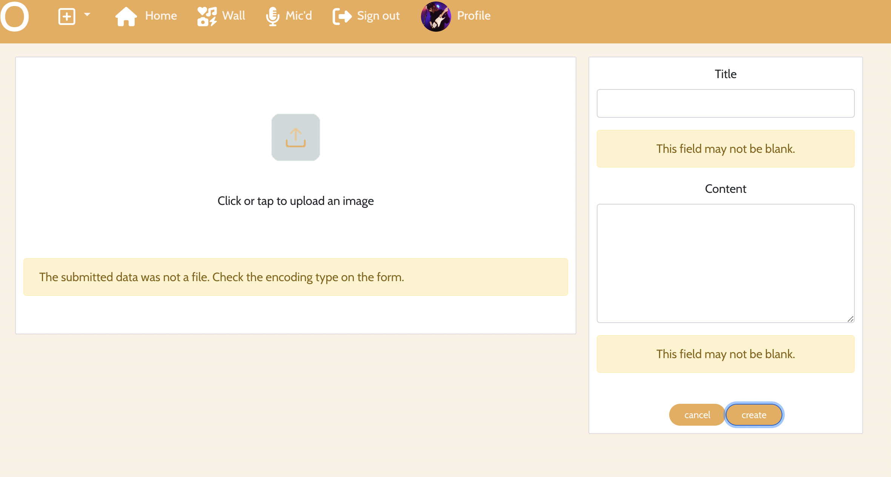

# Melo

## Portfolio Project 5: Advanced Front End Development

This project is built as part of the Code Institute Full Stack Software Development course. For this course, Dirk Ornee had to built a fifth Portfolio Project. The focus of this project is having a good interactive front-end built in React and a backend built with Django REST that functions as a API to the frontend. This repo contains the front end part of the project. Since Dirk Ornee is himself a musician, it seemed a good idea to built a social media platform for musicians, where users can find a connect with other musicians and discover and promote new music.

<!-- TOC -->

- [Melo](#melo)
  - [Portfolio Project 5: Advanced Front End Development](#portfolio-project-5-advanced-front-end-development)
  - [Live Site](#live-site)
  - [Github Repository](#github-repository)
  - [UX](#ux)
    - [Business Goals](#business-goals)
    - [Target Audience](#target-audience)
    - [User Stories](#user-stories)
    - [Structure of the app](#structure-of-the-app)
    - [Color Scheme](#color-scheme)
    - [Features](#features)
      - [Welcome to Melo](#welcome-to-melo)
      - [Home page](#home-page)
    - [Wall page](#wall-page)
      - [Mic'd page](#micd-page)
      - [Profile page](#profile-page)
      - [Publish posts and songs](#publish-posts-and-songs)
      - [Publish posts and songs](#publish-posts-and-songs)
      - [Sign-out](#sign-out)
    - [Future Features](#future-features)
  - [Credits](#credits)
    - [Code](#code)
    - [Images](#images)
    - [Technologies used](#technologies-used)
      - [Frameworks, languages, other](#frameworks-languages-other)
      - [Libraries](#libraries)
      - [Components](#components)
  - [Testing](#testing)
  - [Security Features and Defensive Design](#security-features-and-defensive-design)
    - [User authentication](#user-authentication)
    - [Form Validation](#form-validation)
  - [Deployment](#deployment)
    - [Local Deployment](#local-deployment)
    - [Production Deployment Initial](#production-deployment-initial)
      - [Create Heroku app:](#create-heroku-app)
      - [Deploy App on Heroku:](#deploy-app-on-heroku)
  - [Acknowledgements](#acknowledgements)

<!-- /TOC -->

## Live Site

Back-End:
[Melo-api](https://melo-api.herokuapp.com/)

Front-End:
[Melo](https://melo.herokuapp.com/)

## Github Repository

Back-End:
[PortfolioProjectFiveApi](https://github.com/DOdrums/PortfolioProjectFiveAPI)

Front-End:
[portfolioprojectfive](https://github.com/DOdrums/portfolioprojectfive)

## UX

### Business Goals

The main goal of this project is to give a user the ability to find and connect with musicians on Melo. User is able to get a feel for a musicians playing style and ability and can immediately see (from the 'status' indicator) if somebody is available for new projects or not. Furthermore, a User can share his music and possibly gain some popularity with it, by appearing in the 'Most Mic'd Songs' list.

### Target Audience

It might be obvious, but the target audience of this social media platform is musicians. Melo is the platform where musicians from all level and genre get to together and share their love for music. It is made for beginners to get inspired and follow their role models, but also for professional to share their latest projects and tunes.

The main goal of this project is to give a user the ability to interact with other musicians and share their own content in a social media platform called Melo. By creating a profile in Melo, the user should also be able to share with the network information such as country of residence, instrument of choice and level, and whether they are looking for a bandmember or a band to play in.

### User Stories

The user stories have the following criteria:

- title
- clear description
- acceptance criteria
- tasks, when acceptance criteria alone weren't clear enough
- story points
- epic
- priority (must have, should have, could have)

In the picture below you can see an example of the user stories when work on the project had just begun:

And the user stories board after finishing the project:

As you can see, four user stories were left which didn't fit in the scope of the project in the end. Since they were a 'could have' or 'should have' the decision to leave it out was easily made. To view all the user stories in detail, visit the project page: [user stories board](https://github.com/users/DOdrums/projects/4)

### Structure of the app

The app is designed to have a good natural flow, with minimal page reload necessary. When visiting the three main pages (Home, Wall, Most Mic'd), only the posts and songs get re-fetched and reloaded, but all the other elements stay as they are. This saves time on page reload and gives a general better User Experience. Most of the features of the app will be clear from the get go, especially considering most users will be familiar with social media platforms and their basic functionality.

### Color Scheme

The color scheme was picked to display a calming and soothing feel. The platform should be a place to relax and have fun with other musicians, not to compete. A lot of social media platforms have the tendency to drive competition in an unhealthy way. For this reason, the amount of like or mic's under a post or song are also not shown.

### Features

The app is divided into multiple features that create a full and complete product. Since this is a social media platform, logged in users will have a different user experience than logged out users. Let's start from this distinction:

#### Welcome to Melo

When a user first go to https://melo.herokuapp.com/, the view will appear as shown below:

In this page, all users will be able to see posts from other users and most mic'd songs (will be described later), even if they haven't signed up in the platform. For this reason, in this page, they will have the chance to perform two main actions: sing in and sign up.

With the sign up button, they will be rerouted to a sign up form which asks for basic information namely the Username, new password, and confirmation of the password. By clicking on the 'sign up' button, they will create a account. However, if they already have a profile, they will be able to sign in following the 'Already have an account? Sign in' button under the form, or the 'Sign in' button in the nav bar.

When the user has already a profile, they can click on the 'Sign in' button which will take them to the sign in page. This page asks only for the Username and password and gives the chance to create a new account with the 'Don't have an account yet? Sign up.' button.

Once the user is signed in with their (new) account, they will have more options in the nav bar, as it is shown in the picture below.

Let's talk about each of these features one by one starting with the Home page.

#### Home page

As discussed earlier, the home page is visible for both users that don't have an account yet, and for those who do. This section is divided into two main features, the posts and songs sections, and the 'Most mic'd songs' section.

The post and song section displays all posts and songs uploaded by any user in chronological other, from newest to oldest.

In this page, users are able to:

- Like a post by clicking on the heart icon below the picture. The heart will turn red to confirm the like
- Mic a song by clicking on the microphone (mic) icon below the song. The mic will turn red to confirm the like (as shown in picture above)
- comment on posts and songs by clicking on the speech bubble icon below the posts and songs. This will take the user to the detail page of the post or song, where they can add their comment and view other comments, as shown in the picture below.
- like a post by clicking on the heart icon below the picture. The heart will turn red to confirm the like;
- like a song by clicking on the microphone (mic) icon below the song. The mic will turn red to confirm the like (as shown in picture above);
- comment on posts and songs by clicking on the speech bubbles icon below the post and song. This will take the user to another page where they can add their comment and/or view other comments, as shown in the picture below.

It is important to keep in mind that only users who are signed in to their account will be able to like and comment on posts and songs.

The other section in the Home page is the 'Most mic'd songs'. This is the top 10 list of the most mic'd songs of all time. It is created by listing all songs in order of mic's count and taking the top 10 songs of this list. Users can always click on any of the songs in the list to have a listen and view the comments left for that song.

Fun fact about the "Most mic'd songs" feature is that it doesn't only appear in the home page, but also in all the other pages (Wall, Mic'd and Profile) so users can view this list at any time.

### Wall page

Users can go to their wall by clicking on the icon on the top bar. The difference between the Home page and the Wall is that while in the Home page the user views posts and songs from all the accounts in Melo, in their Wall they view posts and songs _only_ from accounts they follow.

A user can follow and unfollow an account by clicking on the username on top of the post or song. This will bring them to the account's profile and on the top right corner of the profile, the user can click on the button to follow or unfollow the account.

More details about the profile page will be described later in this feature list.

The other section in the Home page is the 'Most mic'd songs'. This is the top 10 list of the most mic'd (like by clicking on the mic icon) songs of all time. It is created by calculating the amount of mics the songs posted in the home page have. The song with the most mics becomes number 1 in the list. Users can always click on any of the songs in the list to have a listen and view the comments left for that song.

Fun fact about the "Most mic'd songs" feature is that it doesn't only appear in the home page, but also in all the other pages (wall, mic'd and profile) so users can always relate to this list.

#### Mic'd page

In the Mic'd page, the user is able to view all the song from any account in Melo that they have mic'd (liked by clicking on the mic icon), even if they don't follow them.

The user can of course decide to un-mic'd songs at any point by clicking on the red mic under the song. The mic will turn grey and the song will be removed from the Mic'd page.

#### Profile page

By clicking on the 'profile button', the user will view their own profile. This includes the personal information they decide to share with the network, including:

- name
- profile picture
- whether or not they are looking for a band member or a band to play in
- country of residence
- alias
- bio
- contact info
- instrument

Below the personal information, the user can also view their own posts and songs.

If the user wants to make any changes to their profile information, they will be able to do so by clicking on the thee dots on the right top corner.

With this list, the user can also opt to add or change:

- any field in their personal info
  

- edit or change their instrument of choice including their level
  

- change their username or password.
  

#### Publish posts and songs

One of the main features is the ability to publish content in the social media platform. The user can do so by clicking on the + button on the top bar from any page.

There are two type of content the user can publish: posts (pictures) or songs. Below you can see the example for publishing a song. In this form, the user will be able to attach a audio file of format mp3 or m4a. If the user tries to upload a song of different file format, the validator on the backend will send back feedback, saying the user tried to upload a song of the wrong file format. They will be also required to add a title to the song and a description.

A user can also upload images. This form looks the same as the song form, except the file is an image instead of an audio file. This form will validate the file as well.

The same field validators happens with publishing a post.

#### Sign-out

The last feature visible from the nav bar when a user is signed in is the sign out button. By clicking on 'sign out', the user will be automatically logged out and the page will refresh to the general Home page.

### Future Features

As discussed in the user stories section, a few features have not been built, which would be nice to add later:

- Filter wall for only posts or songs. Perhaps a user is in a loud area and can't listen to song, in this scenario it would be better to just view pictures. Or perhaps the user just wants to listen to some new tunes, so they can filter out the pictures.
- Search Profiles. Though this has not been build, it was definitely planned, as it was a should have. The platform makes a bit more sense when you actually search for profiles with parameters like: instrument, instrument level, country, status. This way musicians can find band mates or bands to play with even easier. The user story 'Filter Profile Search' connects with this feature.
- Profile stats. Though the profile already shows the amount of posts and songs a user has, it could also show if they arr currently in the Most Mic'd song List and what their highest ever position on the Most Mic'd song list has been.

## Credits

### Code

- [Stackoverflow(answer from 'Rajiv Singh')](https://stackoverflow.com/a/69746387/16545052) - for fixing the Heroku deployment bug.
- [Stackoverflow(answer from 'Drew Reese')](https://stackoverflow.com/a/72394679) - for making a dropdown menu in the nav bar.

### Images

All images used in the readme are screenshots of the project and a multi device mock up generated with [mockup generator](https://techsini.com/multi-mockup/index.php)
Images inside the app are all royalty free stock imagery taken from [stock imagery](https://www.pexels.com)

### Technologies used

#### Frameworks, languages, other

[CSS](https://www.w3.org/Style/CSS/Overview.en.html) - to provide styling to the pages.

[JavaScript](https://developer.mozilla.org/en-US/docs/Web/JavaScript) - as main language running the React Framework.

[JSX](https://legacy.reactjs.org/docs/introducing-jsx.html) - as main language for writing React code.

[Bootstrap 5.2](https://getbootstrap.com/) - used to style the grunt of the project.

[Lucidchart](https://www.lucidchart.com/pages/) used to make a database diagram.

[Gitpod](https://www.gitpod.io/) - used to connect a browser based VScode to github.

[Github](https://github.com/) - used for version control and deployment of the website.

[Heroku](https://dashboard.heroku.com/) - to deploy the app.

[Multi Device Website Mockup Generator](https://techsini.com/multi-mockup/index.php) - to create an image of the website shown on different devices.

[Pexels](https://legacy.reactjs.org/docs/introducing-jsx.html) - for royalty free stock imagery.

[Bulk resize](https://bulkresizephotos.com/en) - to batch resize photo's.

#### Libraries

[React-Bootstrap](https://react-bootstrap-v4.netlify.app/) - for being able to use Bootstrap-React components in React
[JWT-decode](https://www.npmjs.com/package/jwt-decode) - for easy decoding and creation of tokens.
[react-infinite-scroll-component](https://www.npmjs.com/package/react-infinite-scroll-component) - to give user a better experience by not having to click next page, but instead being able to "infinitely" scroll through posts and songs.

#### Components

- MoreDropdown.js - to display reusable dropdown in different places throughout the application
- AxiosDefault.js - to make communicating with the backend easy
- Asset.js - used to display spinners and other imagery throughout the application
- CurrentUserContext.js - to check a users logged in status

## Testing

Extensive testing was done to make sure all the features work as expected. To read all about this, please go to the separate [testing document](TESTING.md).

## Security Features and Defensive Design

### User authentication

- A lot of the pages/routes in this app are only accessible to the logged in user. Furthermore, most POST and PUT features will be unavailable to users that aren't logged in. When trying to edit or delete data that isn't owned by the logged in used, the database will sent back an error saying you do not have permission for this action.

### Form Validation

Extensive form validation is used on the front end. You can see examples of this in the features section, where the add post and add song form show error messages. For example, some fields can not be empty, or the file is a wrong format. The sign in and sign up form also have validation, checking if the username is not already taken and if the passwords entered at sign up are identical.

## Deployment

### Local Deployment

To test the app locally, the terminal within VScode was used. The steps to run this:

- In your project workspace folder, open a terminal
- Run the command: `npm run start`
- Hit the 'open browser' button or visit `http://localhost:8000/` in the browser.
- Use the website as usual.

### Production Deployment Initial

Before starting work, the project was deployed to Heroku. This was done early in the process, to prevent having to deal with difficulties of deployment close to the project deadline. The following steps needed to be performed:

#### Create Heroku app:

- Login in to Heroku
- Create a new app.
- Select "New" and "Create new app".
- Give the new app a name and click "Create new app".
- Select a region (Europe for this app).

#### Deploy App on Heroku:

- Click on the Deploy tab
- Under "Deployment Method" click on "GitHub" to get access to your repository.
- Enable Automatic Deploys" or click "Deploy Branch" to deploy your app.

## Acknowledgements

This website was built as part of the Full Stack Software Development course from Code Institute. I would like to thank my mentor Adeye Adegbenga, for his excellent feedback and guidance throughout the development of the project. I would also like to thank friends and family, who all took a look at the finished project to make sure it worked well and checked if I could improve things.
